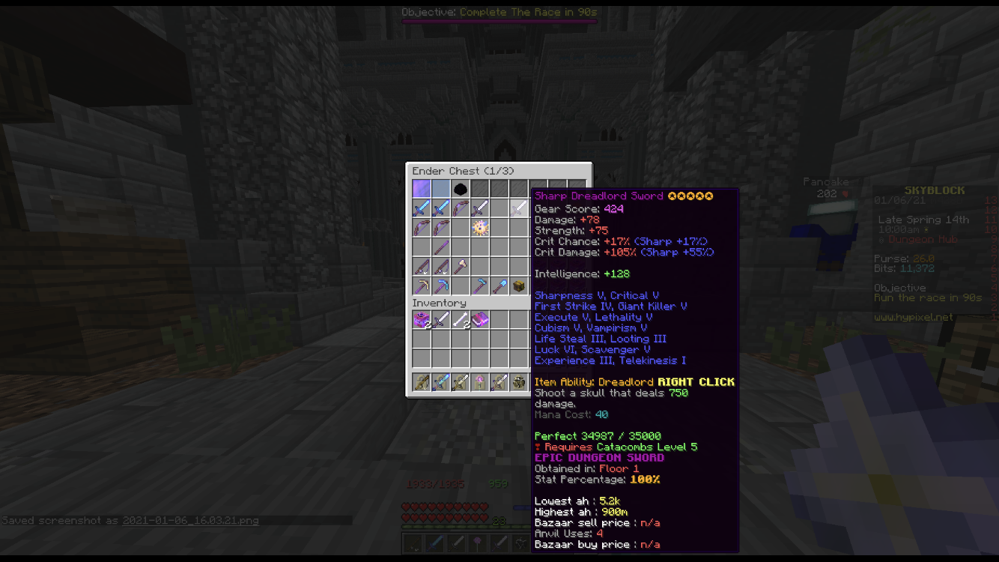

# Dungeon QoL features

There are also many miscellaneous configurable features here

1. Spirit Boots Fixer. Fixes spirit boots changing your hand to air!
2. Dungeon Stat and Price viewer. Shows what floor was an item obtained, and how good the item is \(percentage\). Also shows the price on bin and ah
3. Reparty command, and auto reparty on dungeon end. Disbands and invites all the members.
4. Disable ability messages such as "your blah hit blah for blah damage"

