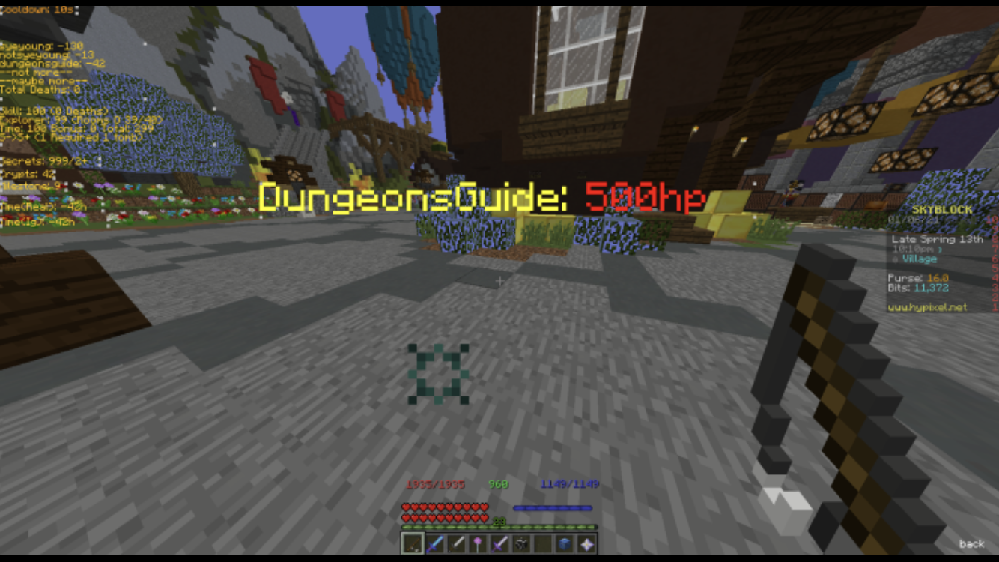
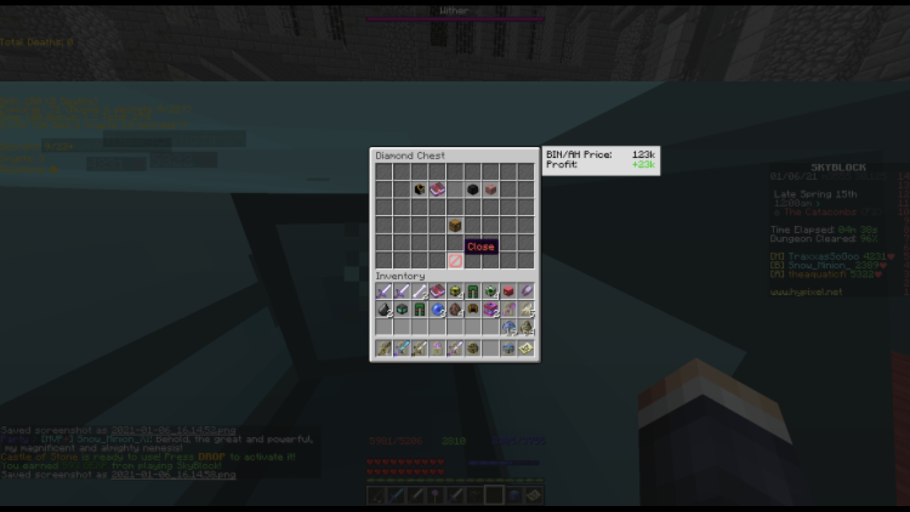
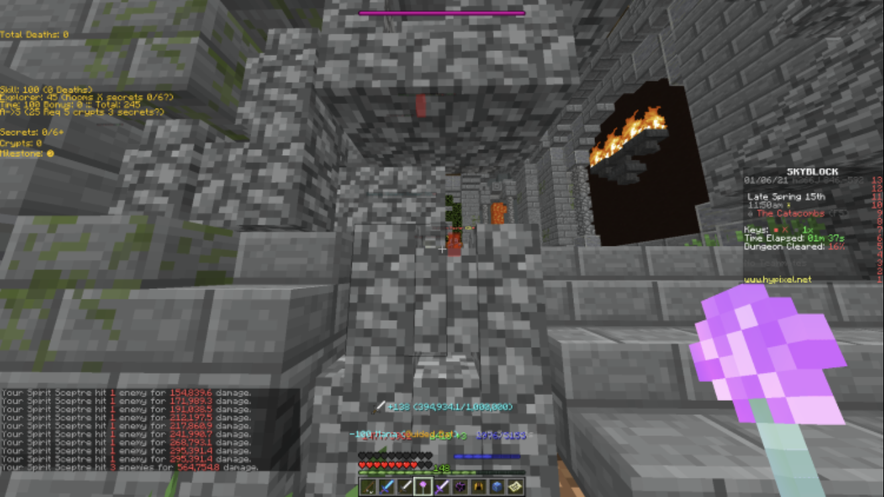
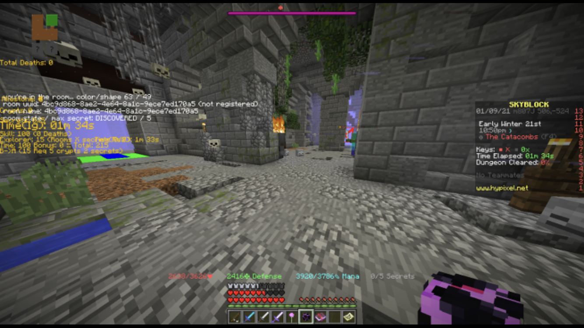
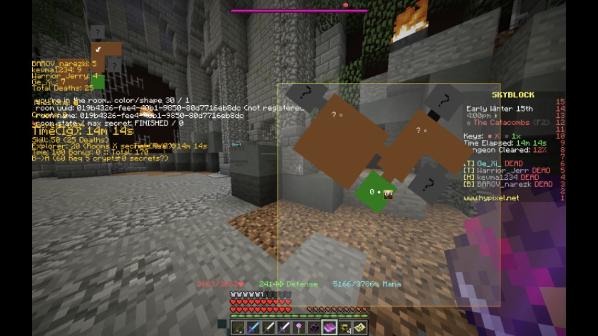
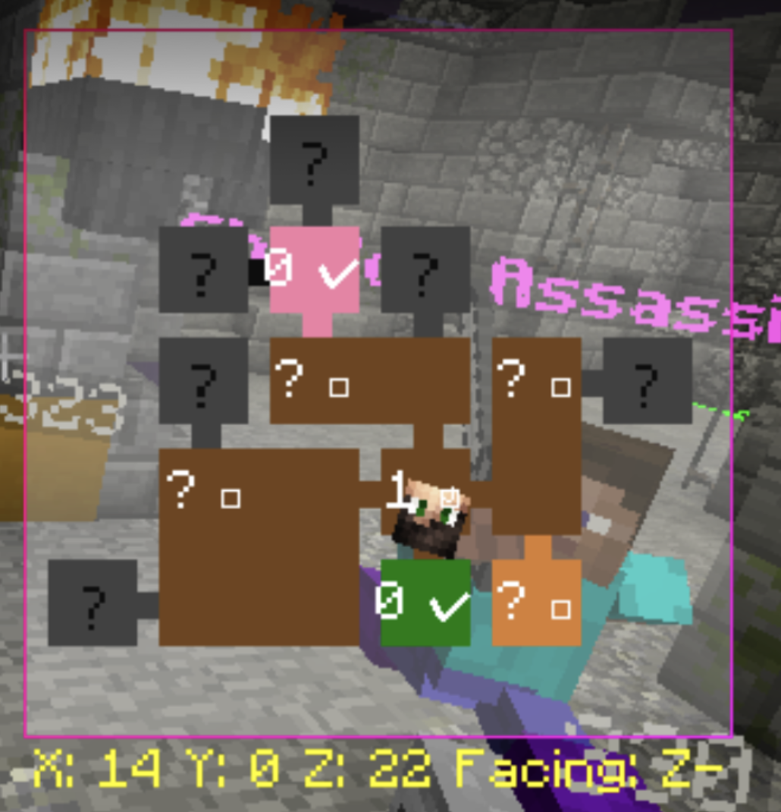
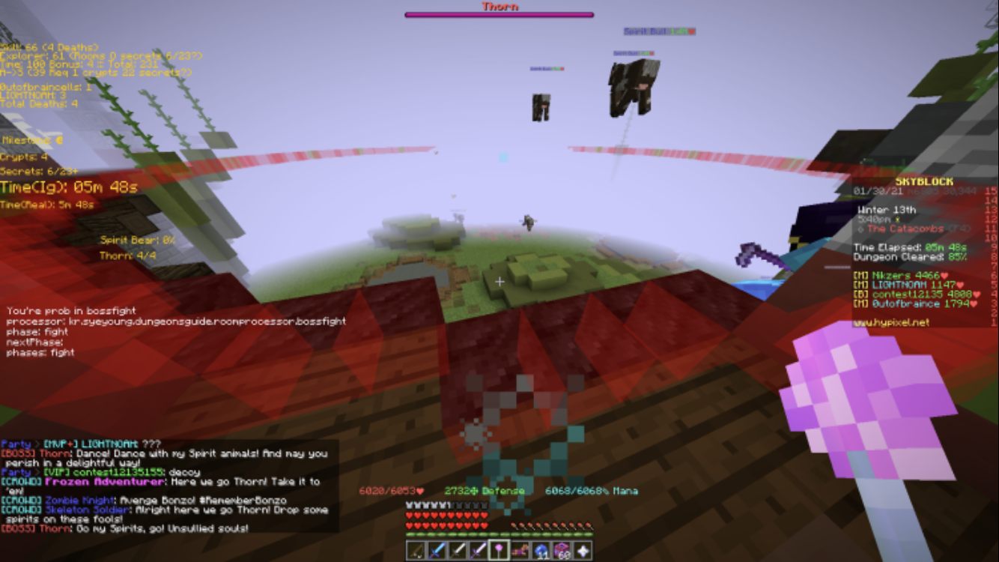
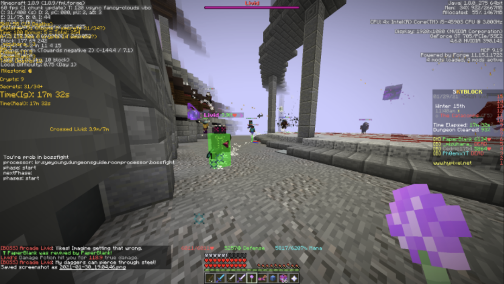
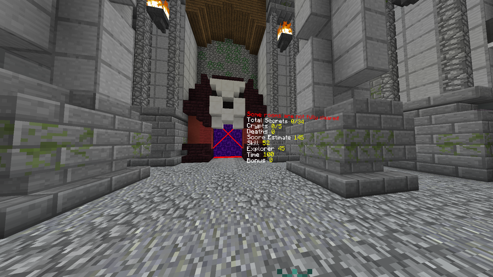

# Dungeons Hud

There are many miscellaneous configurable features here, but I believe the most amazing one is pre-score-calculation. \(Calculates expected dungeon score before entering dungeon\)

Every HUD is toggleable and configurable. \(Change colour, move, resize, etc\)

* Features showed in the screenshot \(Top-down left-right\)
* Dungeon Cooldown indicator. Counts 20 seconds since you left the dungeon
* Dungeon Death indicator. Shows who died how many times, also shows total
* Dungeon Score Pre-calculator. Pre calculates dungeon score then shows how many secrets need to be taken for the next letter
* Obtained Secret indicator. Shows how many secrets / total secrets have been found and exist in dungeons
* Broken Crypts Indicator. Same as what Tab-list shows, but without pressing the tab
* Current Milestone Indicator. I think the name explains it all
* Real-Time Indicator. Shows how much time has passed since starting the dungeon
* Ingame Time Indicator. Shows how much time Hypixel thinks passed since starting the dungeon
* Low-Health Warning: Shows Player name and health if the player's health is lower than 500

